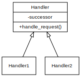

# Intention

It is to decouple request client and handler. In this pattern, handlers and clients are not hard bound.

# Example

We have two handlers chained, with handler1 being the successor of handler2. If handler2 does not handle requests, then it passes the requests to handler1. 

In this example, a request is ignored if both handlers do not handle it. There can be a "final" handler that handles requests if no other handlers do not handle it.