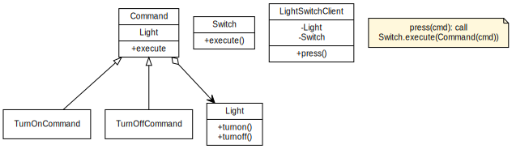

# Indent

It is to decouple the invoker of a request to a specific request.

# Overview

There are basically four objects in this pattern:

- Command: it knows about *receiver* and invokes a method of the receiver. Values for parameters of the receiver method are stored in the command. The receiver object to execute these methods is also stored in the command object by **aggregation**.
- Receiver: it does the work when `execute()` method in *command* is called.
- Invoker: it knows how to execute a command, and optionally does bookkeeping abount the command execution. It does not know anything about a concrete command, it knows only about command interface.
- Client: it holds invoker object(s), command objects and receiver objects. It decides which receiver objects it assigns to the command objects, and which commands it assigns to the invoker.

# Example

This example shows turning on and off a light by a switch. The `LightSwitchClient` holds the `Light` and `Switch` object. Which command to execute is determined at runtime and is passed to `Switch.execute()` method. This method only knows the interface of the command and does not know any details. In contrast, the command holds the `Light` object which is passed to command's constructor, thus the command knows what to do with `Light`.