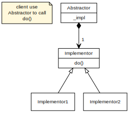

# Intention

The bridge pattern is to seperate implementation from abstraction and give the capability of run-time binding.

# Example

It is a bit like `Adapter` pattern in that they both 'delegate' method calls. Actually, if you 'wrap' `Abstractor` in a class, and use that class as a client, you'll find it contains the `Adapter` pattern. That is to say, bridge pattern is usually implemented using adapter pattern.