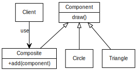

# Intention

When dealing with **tree-structured** data, programmers oftern have to discriminate between a leaf-node and a branch. This makes code more complex. The solution is to define an interafce that allows treating complex and primitive objects uniformly.

# Example

We have a 'complex' figure which consists of a circle and a triangle. We want to draw this figure. Drawing it directly requires too much effort and not flexible (imagine there are many complex figures consisted of various shapes). Instead, we define a base class `component`, and **make both complex figure and shapes inherit this class**.