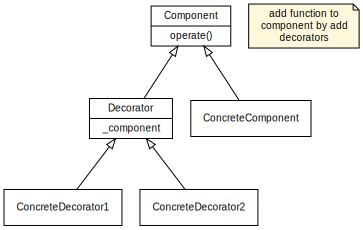

# Intention

To add functionality to objects at run time.

# Example



We have a `ConcreteComponent` object, which can perform some basic operations. At run time, we need another `ConcreteComponent` object that can perform some "advanced" operations based on basic operations. Instead of creating another ConcreteComponent inheriting the existing one, we use decorator to add the functionality at run time:

```python
    comp = ConcreteComponent()
    comp.operate()
    comp1 = ConcreteDecorator1(comp)
    comp1.operate()
    comp2 = ConcreteDecorator2(comp1)
    comp2.operate()
```