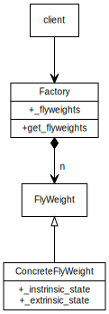

# Intention

It is to solve the following situation:

- a lot of objects are created
- objects can share some "intrinsic state", while their "extrinsic state" may differ. So objects can be reused by replacing "extrinsic state" and keeping "intrinsic state" untouched.

This pattern is usually along with the `Factory` pattern to control object creation.

The "instrinsic state" should be immutable. And object creation should be very careful in concurrent processing.

# Example

We created a lot of `ConcreteFlyWeight` objects. When creating an object, the factory first check whether an object with required instrinsic state is already created. If so, return the created object, otherwise create a new object.