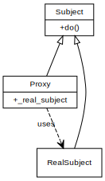

# Intention

Proxy provide a surrogate or placeholder for another object to control access to it.

There are common situations in which the Proxy pattern is applicable.

1. A virtual proxy is a place holder for "expensive to create" objects. The real object is only created when a client first requests/accesses the object.
2. A remote proxy provides a local representative for an object that resides in a different address space. This is what the "stub" code in RPC and CORBA provides.
3. A protective proxy controls access to a sensitive master object. The "surrogate" object checks that the caller has the access permissions required prior to forwarding the request.
4. A smart Proxy provides sophisticated access to certain objects such as tracking the number of references to an object and denying access if a certain number is reached, as well as loading an object from database into memory on demand

# Example

